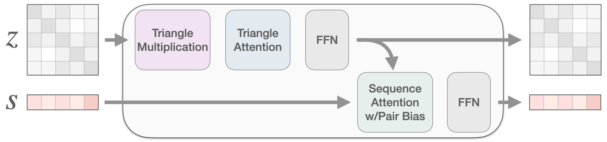
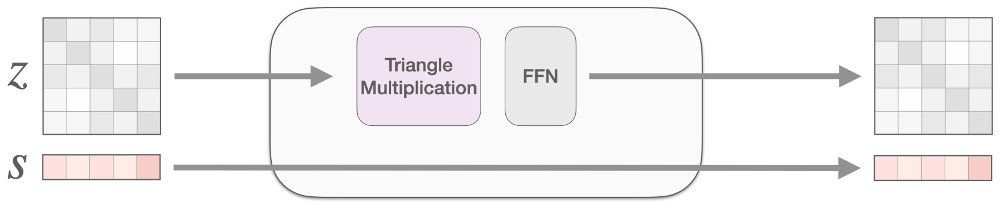

# Pairmixer

[](https://opensource.org/licenses/MIT)
[](https://www.python.org/downloads/)
[](https://arxiv.org/abs/2510.18870)


By [Jeffrey Ouyang-Zhang](https://jozhang97.github.io/)<sup>a,b</sup>, [Pranav Murugan](https://pranavmurugan.github.io)<sup>a</sup>, [Daniel J. Diaz](http://danny305.github.io)<sup>b</sup>, [Gianluca Scarpellini](https://scarpellini.dev/)<sup>a</sup>, [Richard Strong Bowen](http://rsbowen.github.io)<sup>a</sup>, [Nate Gruver](https://ngruver.github.io)<sup>a</sup>, [Adam Klivans](https://www.cs.utexas.edu/users/klivans/)<sup>b</sup>, [Philipp Krähenbühl](http://www.philkr.net/)<sup>b</sup>, [Aleksandra Faust](https://www.afaust.info)<sup>a</sup>, and [Maruan Al-Shedivat](https://maruan.alshedivat.com)<sup>a</sup>

<sup>a</sup>Genesis Research &nbsp;&nbsp; <sup>b</sup>UT Austin

This repository is an official implementation of the paper [**Triangle Multiplication is All You Need for Biomolecular Structure Representations**](https://arxiv.org/abs/2510.18870).

**TL; DR.** Pairmixer is an efficient alternative to AlphaFold3's Pairformer that eliminates triangle attention while preserving geometric reasoning, delivering up to 4× faster inference and 34% lower training cost.

<p align="center">
  
  <br/>
  <em>Pairformer Architecture</em>
</p>

<p align="center">
  
  <br/>
  <em>Pairmixer Architecture</em>
</p>

## Download Model

```bash
# recommended
huggingface-cli download genesisml/pairmixer --local-dir /path/to/save/pairmixer

# alternative
git clone https://huggingface.co/genesisml/pairmixer
```

## Installation

```bash
git clone https://github.com/jozhang97/pairmixer.git
cd pairmixer
conda create --name pairmixer python=3.12 -y
conda activate pairmixer
pip install -e .
```

## Quick Start

See [boltz prediction docs](docs/prediction.md) for more details.
```bash
pairmixer predict examples/prot_custom_msa.yaml --no_kernels
```

To pass in a custom checkpoint:
```bash
pairmixer predict examples/prot_custom_msa.yaml \
  --no_kernels \
  --model pairmixer \
  --checkpoint ./models/pairmixer/pairmixer.pth
```

## Training

For benchmarking, we follow the Boltz-1 training protocol as closely as possible. Specifically, we train phase 1 for 68 epochs and phase 2 for 20 epochs.
The released model is further trained with two additional phases: the first uses larger crop sizes, and the second introduces an AF3-style confidence head.
Training is managed with slurm, and stopping is performed manually. Note that certain variables are hardcoded in the Slurm scripts and must be updated for training to run correctly.

Pairmixer training:
```bash
sbatch scripts/slurm/train.slurm scripts/train/configs/structure_pairmixer_phase1.yaml
sbatch scripts/slurm/train.slurm scripts/train/configs/structure_pairmixer_phase2.yaml
sbatch scripts/slurm/train.slurm scripts/train/configs/structure_pairmixer_phase3.yaml
sbatch scripts/slurm/train.slurm scripts/train/configs/full_pairmixer_phase4.yaml
```

Baseline training:
```bash
sbatch scripts/slurm/train.slurm scripts/train/configs/structure_phase1.yaml
sbatch scripts/slurm/train.slurm scripts/train/configs/structure_phase2.yaml
```

## Evaluation

We evaluate our model on the Boltz-1 RCSB and CASP15 test sets.
To reproduce the evaluation, first download the test data (MSAs, input files, output files and evaluation outputs for Boltz-1, Chai-1, and AlphaFold3) from their [Google Drive folder](https://drive.google.com/file/d/1JvHlYUMINOaqPTunI9wBYrfYniKgVmxf/view?usp=sharing) following the instructions in the [Boltz evaluation docs](docs/evaluation.md).
Save the downloaded files to `logs/boltz_results_final/`.

Get Pairmixer predicted structures:
```bash
sbatch scripts/slurm/predict.slurm all pairmixer \
  --model pairmixer \
  --checkpoint /path/to/save/pairmixer/pairmixer.pth
```

Compute metrics:
```bash
sbatch scripts/slurm/evaluate.slurm all pairmixer
```

Produce bar plot vs literature:
```bash
mkdir -p logs/boltz_results_final/outputs/casp15/pairmixer
mkdir -p logs/boltz_results_final/outputs/test/pairmixer
cp -r logs/boltz_results_final/predictions/casp15/pairmixer/boltz_results_queries/predictions logs/boltz_results_final/outputs/casp15/pairmixer/predictions
cp -r logs/boltz_results_final/predictions/test/pairmixer/boltz_results_queries/predictions logs/boltz_results_final/outputs/test/pairmixer/predictions
python scripts/eval/aggregate_evals_v2.py pairmixer
```

## License

This source code is licensed under the MIT license found in the LICENSE file.


## Citation

If you find Pairmixer useful in your research, please consider citing:
```bibtex
@inproceedings{pairmixer2025,
  title={Triangle Multiplication is All You Need for Biomolecular Structure Representations},
  author={Ouyang-Zhang, Jeffrey and Murugan, Pranav and Diaz, Daniel J. and Scarpellini, Gianluca and Bowen, Richard Strong and Gruver, Nate and Klivans, Adam and Kr{\"a}henb{\"u}hl, Philipp and Faust, Aleksandra and Al-Shedivat, Maruan},
  year={2025},
}
```

## Acknowledgments

We thank the authors of Boltz-1 for their open-source implementation.
